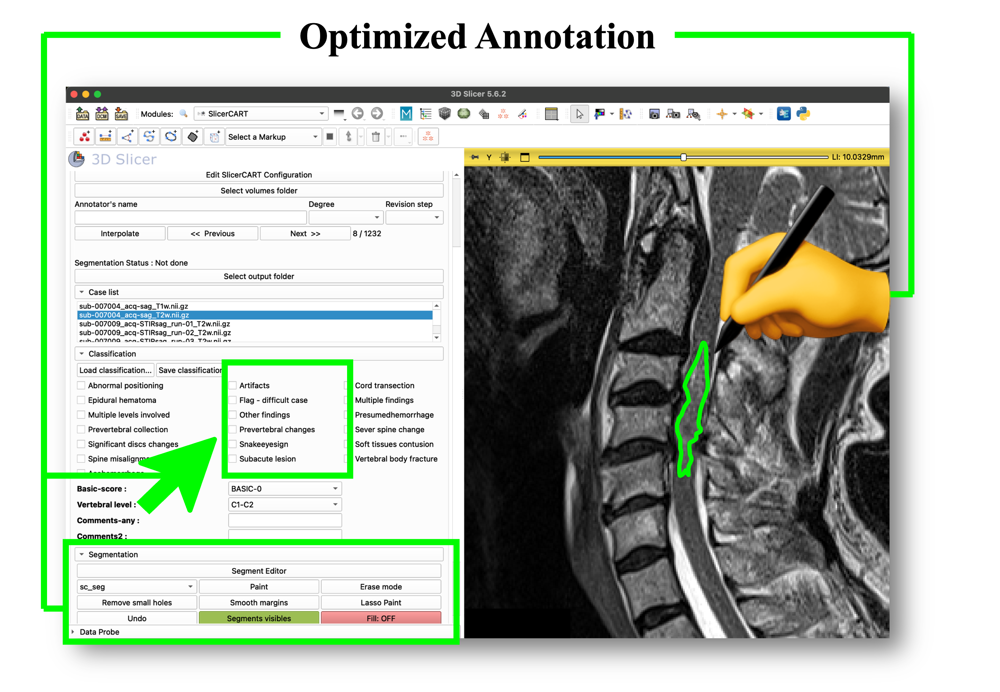
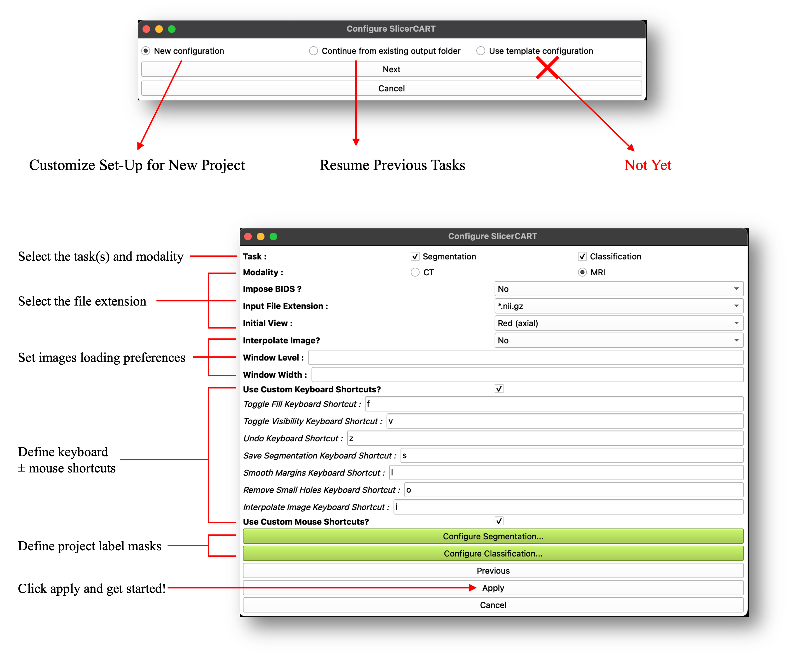
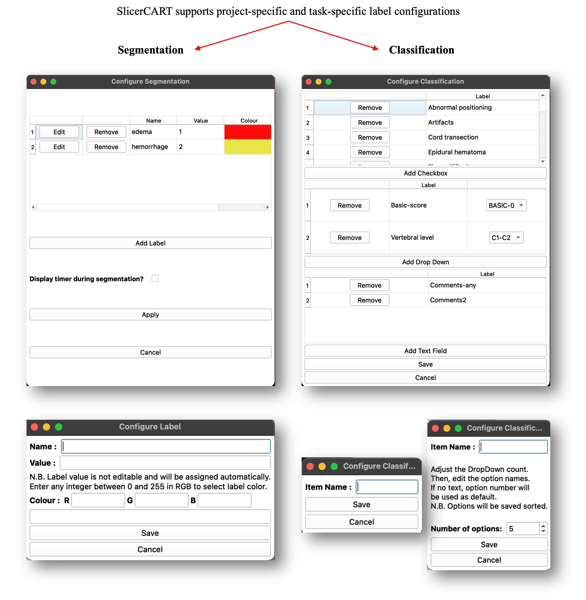
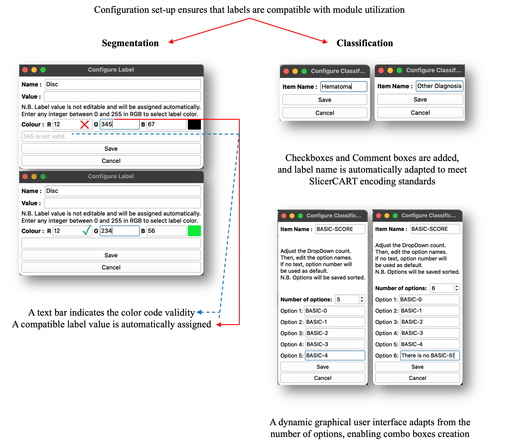
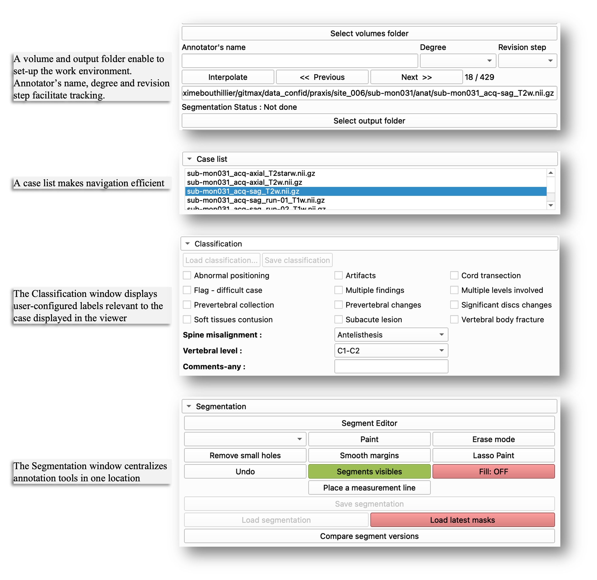
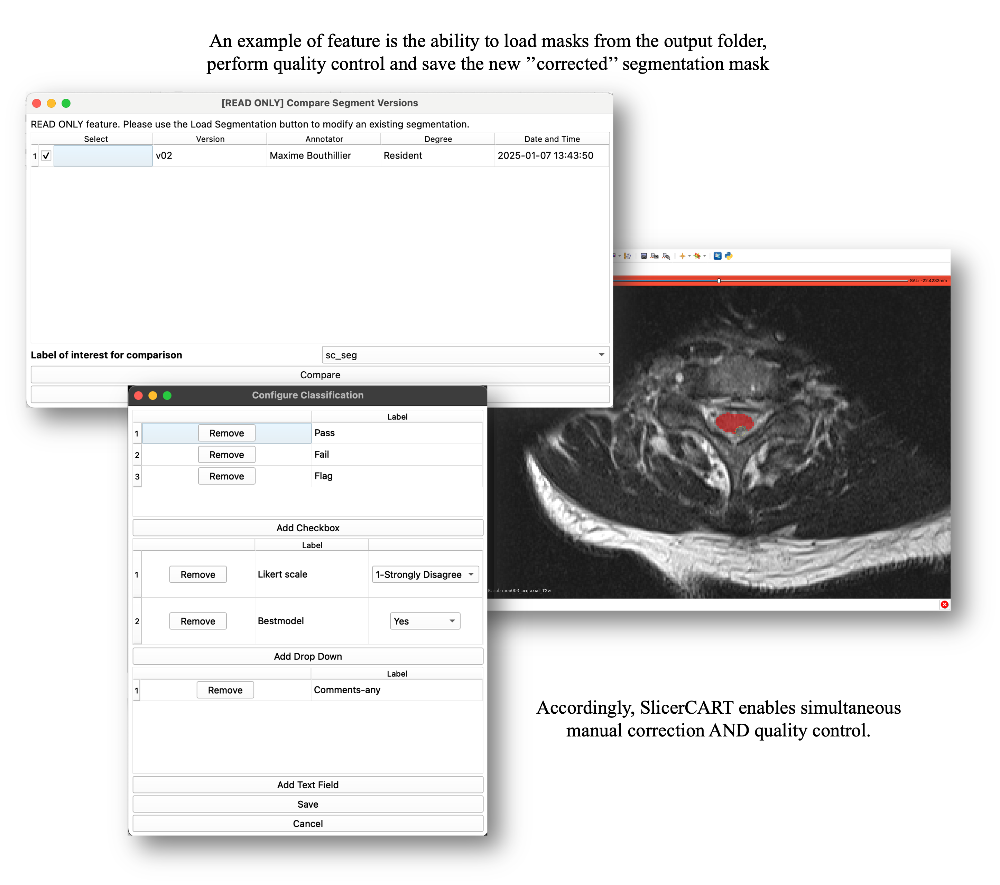
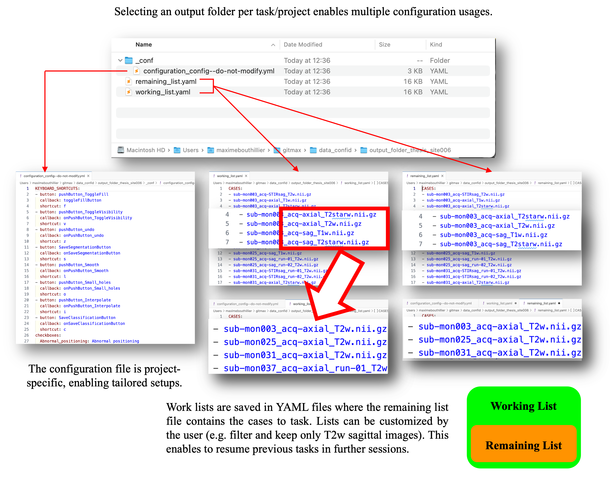

User Guide
=====================

Detailed information for using SlicerCART is provided below.

Overview
-------

SlicerCART supports efficient multi-subjects imaging data navigation, labeling, and segmentation. This figure shows the module graphical user interface at launching.

For a complete list of functionalities, see :doc:`functionalities`.

.. toctree::
   :hidden:

   functionalities

Launching
-------

When the module is loaded, a pop-up window appears and allows the user to preset the module according to the intended use case. SlicerCART can be configured to accommodate task-specific requirements and user preferences, depending on the intended use. New Configuration allows to define a new project labels and specificities. Continue from existing output folder enables to continue a previously started task. Some configuration examples are illustrated:

- **Task:** select if the module is used for segmentation, classification or both.
- **Modality:** select if volumes are CT-Scans or MRI
- **Impose BIDS?:** related to folder organization and files naming convention. Select yes if you want to load volumes only if the folder organization respects the *Brain Imaging Data Structure* (BIDS) format (once a volume folder will be selected, a BIDS validator will be run and a pop-up window will show if the selected folders do not respect BIDS: in that case, the volumes will not load).
- **Input File Extension:** specify the files' extension. Currently, whether NIfTI or NRRD format is accepted only. Note that if a dataset (i.e. volume folder) contains both nifti and nrrd volumes, the module will not be able to work (you can choose either one or another, but not both).

- **Initial View:** select the view (axial, sagittal, or coronal) that the 3D Slicer viewer will display.

  .. note::

     In 3D Slicer, each viewer plane has an associated default color:

     - **Red** – Axial
     - **Yellow** – Sagittal
     - **Green** – Coronal

- **Interpolate Image?:** select if loaded volumes from raw MRI data have automated postprocessing treatment to make the image smoother. Note that this is usually automatically done in Slicer: however, for example, deep-learning based models used for segmentation are trained on raw MRI data which may create imprecise ground-truth segmentation masks or compatibility issues. Note also that although if images are interpolated, segmentation masks are by default saved without any smoothing filter (compatible for deep learning model training).
- **If Modality == CT:**
  The Window Level and Window Width default level can be selected, enabling to display a specific default contrast for each volume. Accepts only integers.
  Note that if you have selected CT, but do not want to specify the contrast information, the default volumes will be loaded using a Window Width/Level of 45:85.
- **Use Custom Keyboard Shortcuts?:**
  Select to show enable customization of keyboard shortcuts for predefined basic functions. Shortcut name corresponds to its action.
- **Use Custom Mouse Shortcuts?:**
  Select to show a dropdown menu enabling customization of mouse button functions for mage manipulation in the 3D Slicer viewer.

Configure segmentation
~~~~~~~~~~~~~~~~~~~~~~

Allows the user to specify the default labels name, value and display colors
for each segmentation mask in the dataset. For example, if the task is to do
segmentation of traumatic spinal cord injury lesions defined by
intramedullary edema and hemorrhage as distinct segmentation classes, the
user can specify the label names (e.g. edema — for spinal cord edema;
hemorrhage — for intramedullary hemorrhage). The user can change the number
of labels by clicking remove or add (see :ref:`label-selection-and-validation`).

Configure Classification
~~~~~~~~~~~~~~~~~~~~~~~~

Allows the user to specify the labels and their value related to classification types, and their selection mode.

.. _label-selection-and-validation:
Label Selection and Validation
~~~~~~~~~~~~~~~~~

The module allows users to add, remove, and customize labels for manual segmentation and classification. Interface elements such as combo boxes, drop-down menus, and text fields can be configured based on the specific requirements of the task. Click apply to save the  configuration.

In models utilizing segmentation masks, proper labeling is crucial. Therefore, the label selection and saving process for both segmentation and classification tasks are standardized.

The user is now ready to start doing segmentation or classification tasks!

User Interface
-------

Once the configuration is complete, one essential step remains before starting: the user must select the volume folder (where imaging data are located) and output folder (where masks, processed data, and other task-related files will be saved). The annotator name, degree and revision step can be added for tracking purposes, with the date and time automatically logged at each case-version save. The Case list facilitates efficient navigation through large datasets. The Classification window displays the configured labels. The Segmentation window centralizes key tools for annotation.

Use Cases Versatility
-------

SlicerCART supports loading batches of cases along with their existing segmentation masks. Users can select a specific version (assuming ``_vXX`` is in filename before extension (e.g. ``_v01.nii.gz``), rate each case (quality control) and, if necessary, annotate and correct the masks. Updated versions are saved automatically (e.g. if the original mask is labeled as ``_v02``, the new version becomes ``_v03``). *Limitation: 99 versions per file*.

Workflow Example
-------

When a new output folder is selected, SlicerCART automatically generates a configuration file and worklist files. The configuration file serves as a future reference for resuming the task later—especially useful if SlicerCART has been used for another project with a different setup in the meantime. The worklist can be customized to include or exclude specific cases based on filenames, allowing targeted analysis and streamlined navigation within large datasets. Important: the remaining list must be ≤ than the working list. If the files are incompatible, the user will be prompted to verify them.

